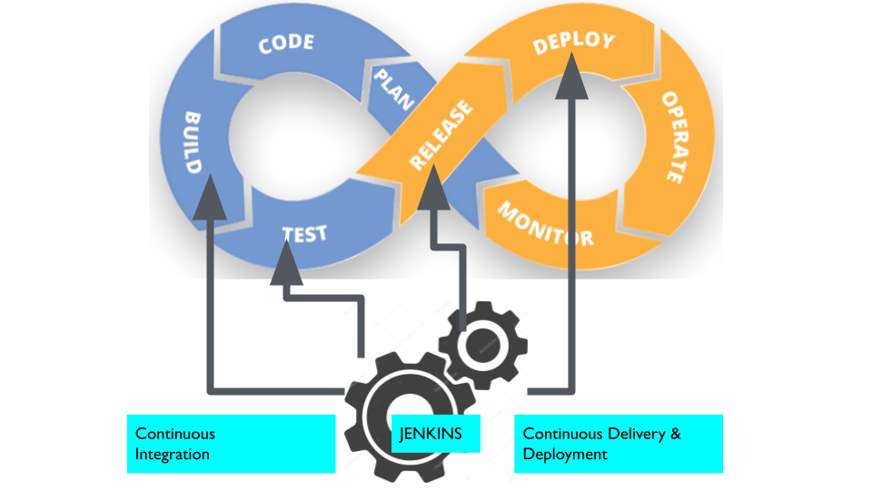

# 01_01 Jenkins and the DevOps lifecycle
The DevOps lifecycle consists of eight stages in the planning, development, and operation of a system or software application:

- Plan
- Code
- Build
- Test
- Release
- Deploy
- Operate
- Monitor

Jenkins can be applied in the following steps:

- Build
- Test
- Release
- Deploy

## Jenkins and Continuous Integration
Continuous integration, often abbreviated as CI, is tied to the build and test phases of the devops lifecycle.  The main goal of continuous integration is to find and resolve problems early in the development cycle.  These steps also produce an artifact that can be deployed.

Jenkins automates building and testing by running commands that create the software artifact and run it through a series of tests.  This artifact could be a container image, a Java archive, a windows executable, or any other sort of software package.

## Jenkins and Continuous Delivery
Continuous delivery and deployment are often referred to as CD.  CD is tied to the release and deploy stages of the DevOps life cycle.  These stages take an artifact and make it available for use or actually put it to work.

The release stage  is where the delivery happens.  Jenkins may upload a container image to a registry or make a JAR file available for downloading. Ultimately, delivering the artifact means that a version of the application is available and ready to be used.  The next step is to deploy.

In some cases, the deployment is manual.  For a continuous deployment, all steps are automated and completed with no, or very little, human interaction.  In our case, we would give Jenkins the instructions needed to deploy automatically.

